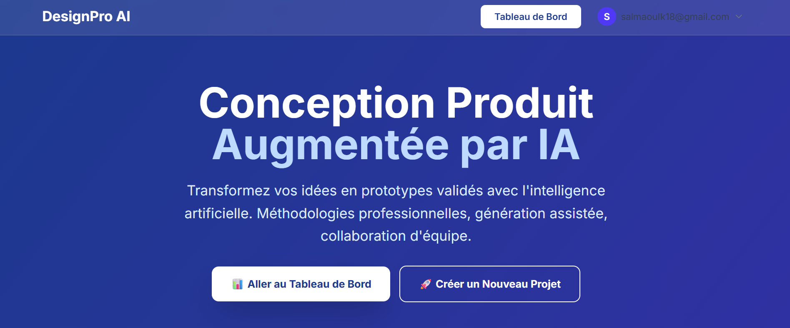

#  DesignPro AI - Plateforme de Conception Industrielle Intelligente

DesignPro AI est une application SaaS innovante qui révolutionne le processus de design industriel grâce à l'intelligence artificielle générative. Elle accompagne les créateurs de l'idéation à la validation technique, en passant par la visualisation haute fidélité.



##  Fonctionnalités Clés

###  1. Idéation Assistée par IA
- **Prompt Engineering Automatique** : Transformation de descriptions simples en prompts techniques détaillés via **Mistral AI**.
- **Méthodologies Intégrées** : Support pour TRIZ, Design Thinking, et biomimétisme pour guider la créativité.

###   2. Génération Visuelle Avancée
- **Moteur Multi-Modèles** : Utilisation de **Stable Diffusion XL (SDXL)**, ControlNet et Img2Img via l'API Hugging Face.
- **Sketch-to-Render** : Transformez vos croquis crayonnés en rendus photoréalistes en quelques secondes.
- **Variations Parallèles** : Génération simultanée de 4 alternatives de design pour explorer plus d'options.

###   3. Experts Virtuels & Validation
- **Agent Q (Qualité)** : Analyse critique automatique de l'esthétique et de l'ergonomie.
- **Simulation R.E.A.L.** : Estimation prédictive de la fabricabilité (DFM), des coûts et de l'impact environnemental.

###   4. Gestion de Projet Complète
- Tableau de bord intuitif avec suivi d'avancement automatique.
- Collaboration en temps réel sur les projets.
- Génération de fichiers STEP (CAO) préliminaires.

---

##   Stack Technique

- **Frontend** : [Next.js 14](https://nextjs.org/) (App Router), React, TypeScript, Tailwind CSS.
- **Backend** : [Supabase](https://supabase.com/) (PostgreSQL, Auth, RLS).
- **IA Core** :
  - **Mistral AI** (Logique & Texte).
  - **Hugging Face Inference API** (Image & Vision).
  - **Replicate** (Analyse Visuelle Optionnelle).

---

##   Installation et Démarrage

### Prérequis
- Node.js 18+
- pnpm (recommandé) ou npm
- Compte Supabase
- Clés API (Mistral, Hugging Face)

### 1. Cloner le projet
```bash
git clone https://github.com/votre-username/mon-app-design.git
cd mon-app-design
```

### 2. Installer les dépendances
```bash
pnpm install
# ou
npm install
```

### 3. Configuration des variables d'environnement
Créez un fichier `.env.local` dans le dossier `apps/web` (si monorepo) ou à la racine :

```env
# Supabase
NEXT_PUBLIC_SUPABASE_URL=votre_url_supabase
NEXT_PUBLIC_SUPABASE_ANON_KEY=votre_cle_anon

# IA Services
MISTRAL_API_KEY=votre_cle_mistral
HF_API_TOKEN=votre_token_hugging_face_read_permission
# REPLICATE_API_TOKEN=optionnel
```

### 4. Initialiser la Base de Données
Exécutez les scripts SQL situés dans `supabase/migrations` via l'interface SQL de Supabase pour créer les tables :
- `projects`, `profiles`, `project_members`
- `project_states` (Gestion de l'état d'idéation)
- `project_evaluations` (Stockage des analyses Agent Q/REAL)

### 5. Lancer le serveur de développement
```bash
pnpm dev
```
Accédez à l'application sur [http://localhost:3000](http://localhost:3000).

---

##  Guide d'Utilisation Rapide

1.  **Créer un Projet** : Cliquez sur "Nouveau Projet", définissez le nom et le domaine (ex: Mobilier, Transport).
2.  **Lancer l'Idéation** : Décrivez votre idée. L'IA générera un prompt professionnel.
3.  **Générer** : Choisissez votre méthode (SDXL pour le réalisme, ControlNet si vous avez un croquis).
4.  **Évaluer** : Utilisez l'onglet "Évaluation" pour lancer l'audit par l'Agent Q et la simulation R.E.A.L.
5.  **Valider** : Terminez le projet pour générer le rapport final.

---

##   Structure de la Base de Données

- **`profiles`** : Informations utilisateurs étendues.
- **`projects`** : Métadonnées du projet (Nom, Description, Méthode).
- **`project_states`** : Cœur de l'application, stocke l'état complet de la session de design (prompts, images générées, choix).
- **`project_evaluations`** : Historique des analyses IA.

---


##  Licence

>>>>>>> 69db375c958784f1cfdec7ab4b1cae2dd2a56a1c
